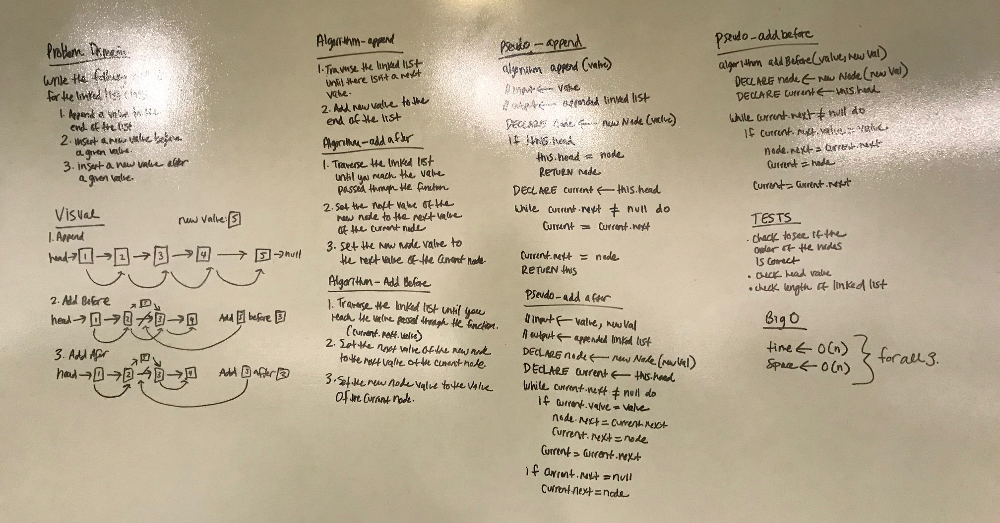

# Linked List Insertions
My partner was not here this week so I worked on this whiteboarding assingment by myself. Kevin helped me with the insert before function as I was having trouble with that one. Also, Hai helped me finish up my insert after function when I was whiteboarding. Big thank you to them as I was stuck on these for a bit!

## Challenge
Write the following methods for the Linked List class:
.append(value) which adds a new node with the given value to the end of the list
.insertBefore(value, newVal) which add a new node with the given newValue immediately before the first value node
.insertAfter(value, newVal) which add a new node with the given newValue immediately after the first value node
You have access to the Node class and all the properties on the Linked List class.

## Solution
