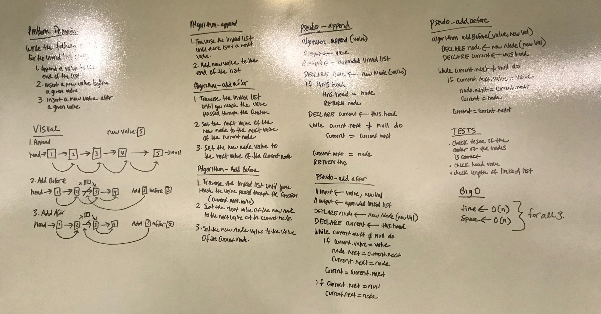

# Linked List Insertions
My partner was not here this week so I worked on this whiteboarding assingment by myself. Kevin helped me with the insert before function as I was having trouble with that one. Also, Hai helped me finish up my insert after function when I was whiteboarding. Big thank you to them as I was stuck on these for a bit!

## Challenge
Write the following methods for the Linked List class:

.append(value) which adds a new node with the given value to the end of the list
.insertBefore(value, newVal) which add a new node with the given newValue immediately before the first value node
.insertAfter(value, newVal) which add a new node with the given newValue immediately after the first value node

You have access to the Node class and all the properties on the Linked List class.

## Solution

## ​K-th value from the end of a linked list ​
My partner was not here this week so I worked on this whiteboarding assignment by myself. I am having an issue with my solution. It works the first time through but for some reason, it is looping through my solution twice and the second time around, the input number is undefined which throws off the tests. I have commented out the tests so the file passes in Travis. Could you take a look at my solution and see if you can figure out why it is looping through my function twice? Thank you! 

## Challenge
Write a method for the Linked List class which takes a number, k, as a parameter. Return the node’s value that is k from the end of the linked list. You have access to the Node class and all the properties on the Linked List class as well as the methods created in previous challenges. ​

## Solution

