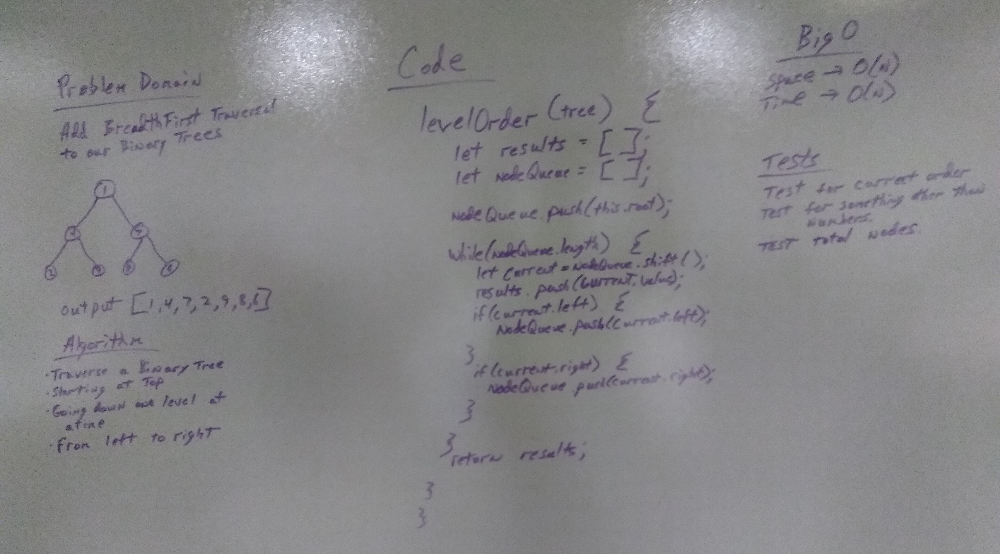

# Trees
Implement classes for both a binary tree and a binary search tree. 

## Challenge
* Create a Node class that has properties for the value stored in the node, the left child node, and the right child node.

##### Create a BinaryTree class
* Define a method for each of the depth first traversals called preOrder, inOrder, and postOrder which takes in a root node, and returns an array of the nodes.
* At no time should an exception or stack trace be shown to the end user. Catch and handle any such exceptions and return a printed value or operation which cleanly represents the state and either stops execution cleanly, or provides the user with clear direction and output.

##### Create a BinarySearchTree class
* Define a method named add that adds a new node in the correct location in the binary search tree.
* Define a method named search that brings in a value of node, and returns the node with the desired value.

## Approach & Efficiency

#### Binary Tree 
###### Big O Time 
O(n)
###### The Big O Space
O(w), with “w” being the largest width of the tree. 

#### Binary Search Tree 
###### Big O Time 
O(log n)
###### The Big O Space
O(1)

## API
The BinaryTree Class construtor sets the root to null.

Preorder() accepts a tree and returns an array of results, in the order of the traversal.

Inorder() accepts a tree and returns an array of results, in the order of the traversal.

Postorder() accepts a tree and returns an array of results, in the order of the traversal.

The BinarySearchTree Class construtor sets the root to null.

Add() accepts a value and adds the value to the tree in the correct spot. 

Search() accepts a value and looks for that value in the tree and returns the node if it exists. If it does not exist, it returns null.  

## Reference
I used [this](https://stackoverflow.com/questions/37292620/how-to-find-value-is-present-in-binary-tree-or-not) Stack Overflow thread to help me with my binary search tree SEARCH function.

# Breadth-first
I worked with Ed & Hollie on this challenge. 

## Challenge
Write a breadth first traversal method which takes a Binary Tree as its unique input. Without utilizing any of the built-in methods available to your language, traverse the input tree using a Breadth-first approach; print every visited node’s value.

## Approach & Efficiency
##### Big O Time 
O(n)
##### The Big O Space
O(w), with “w” being the largest width of the tree.

## Solution
